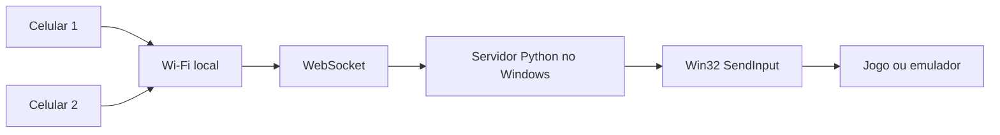

# Celular Gamepad para PC

[Português](README.md) | [English](README.en.md)

Transforme um ou dois celulares em controles para jogos e emuladores no Windows usando o navegador e a rede local. O servidor Python converte os comandos dos celulares em teclas por meio do Win32 `SendInput`.

> A prerelease experimental `1.4.0-beta.3` adiciona conexão local por QR Code, instalador Windows, pacote portátil e um modo opcional de dois controles virtuais XInput. O modo teclado da v1.3 continua disponível para emuladores.

## Destaques

- Um ou dois celulares, com Jogador 1 e Jogador 2 independentes.
- Uso direto no navegador, sem instalar aplicativo no celular.
- Comunicação WebSocket na rede local, PIN temporário por execução e QR Code gerado sem internet.
- Layouts **Retro 16-bit** e **Modern Dual-Stick**.
- Runtime Python portátil, baixado do Python.org no primeiro preparo.
- Funciona offline depois desse preparo.
- Sem dependências Python externas.

## Requisitos

- Windows 10 ou 11 de 64 bits.
- PC e celulares na mesma rede local confiável.
- Navegador moderno no celular.
- Internet somente para baixar o runtime na primeira utilização, se ele ainda não existir.

## Conexão rápida por QR

O terminal mostra um QR de conexão automática e abre, por padrão, uma única página local no PC com QRs automático, Jogador 1 e Jogador 2. Escaneie, confirme o jogador e toque em **Conectar**; o PIN temporário de seis dígitos é preenchido somente na memória e removido da URL do celular. Não há CDN, analytics ou serviço externo. Veja [conexão QR](docs/CONEXAO_QR.md).

## Início rápido

1. Extraia a pasta completa; não execute dentro do ZIP.
2. Execute `LIBERAR_FIREWALL_PRIMEIRO_USO.bat` e aceite a elevação do Windows.
3. Execute `INICIAR_EM_QUALQUER_PC.bat`.
4. Escaneie o QR automático no terminal ou use a página local de QR do PC.
5. Confirme o jogador e toque em **Conectar**.
6. Para slots fixos, use os QRs Jogador 1 e Jogador 2; um slot ocupado não desconecta o outro celular.

O `iniciar.bat` prefere `runtime\python.exe`, usa `py` ou `python` instalado como alternativa e chama o iniciador portátil caso nenhum Python esteja disponível.

### Instalador beta para Windows

A prerelease `1.4.0-beta.3` fornece um instalador único com Python embeddable e bridge .NET self-contained. Ele cria atalhos separados para **Emuladores — Teclado** e **Jogos de PC — Controle virtual**. Veja [conexão QR](docs/CONEXAO_QR.md), [Instalação no Windows](docs/INSTALACAO_WINDOWS.md), [teste em outro PC](docs/TESTE_EM_OUTRO_PC.md), [SmartScreen](docs/SMARTSCREEN.md) e [desinstalação](docs/DESINSTALACAO.md).

O GitHub público `cristianohsm/celular-gamepad-pc` é a fonte oficial. Verifique o SHA-256 e não baixe o instalador de terceiros.

### Iniciar com o Windows

Mantenha a pasta completa em um local fixo, crie um atalho para `iniciar.bat` e coloque **somente o atalho** em `shell:startup`. Não copie o BAT sozinho: servidor, interface e scripts precisam permanecer juntos.

## Teclas padrão — Retro 16-bit

| Comando | Jogador 1 | Jogador 2 |
|---|---|---|
| Cima | Seta para cima | Numpad 8 |
| Baixo | Seta para baixo | Numpad 2 |
| Esquerda | Seta para esquerda | Numpad 4 |
| Direita | Seta para direita | Numpad 6 |
| A | X | N |
| B | Z | M |
| X | S | H |
| Y | A | U |
| L | Q | O |
| R | W | P |
| Start | Enter | B |
| Select | Shift | G |

O Jogador 2 não precisa de teclado numérico físico: os códigos são enviados virtualmente. O mapeamento completo dos dois layouts está em [`config.example.json`](config.example.json).

## Configuração no Snes9x

Em `Input > Input Configuration`, configure `Joypad #1` pressionando os botões do celular do Jogador 1. Depois habilite e configure `Joypad #2` com o celular do Jogador 2. Consulte o [guia detalhado](docs/CONFIGURAR_2_JOGADORES_SNES9X.md).

## Arquitetura



## Segurança

Use apenas em uma rede local confiável. **Não encaminhe a porta TCP 8765 no roteador e não exponha o programa diretamente na internet.** O PIN temporário reduz conexões acidentais, mas não substitui autenticação adequada para exposição pública. Veja [Segurança da rede local](docs/SEGURANCA_REDE_LOCAL.md) e [SECURITY.md](SECURITY.md).

## Controle virtual experimental

O modo **Controle virtual / Jogos de PC** usa um bridge C# local e HIDMaestro `v1.3.17` fixado por SHA-256 para criar dois dispositivos com perfil Xbox 360/XInput. Não abre porta adicional e mantém cada celular isolado em seu slot.

Requisitos atuais: Windows 11 64 bits build 26100+, consentimento para instalação e UAC. O SDK também exige elevação para criar os dispositivos durante a sessão. Se o bridge estiver ausente ou falhar, o servidor volta de forma controlada ao modo teclado.

Use Modern Dual-Stick para jogos 3D; Retro 16-bit não possui todos os comandos. Consulte [Modo controle virtual](docs/MODO_CONTROLE_VIRTUAL.md), [instalação](docs/HIDMAESTRO_INSTALLATION.md) e [protocolo](docs/XINPUT_PROTOCOL.md). **A compatibilidade com It Takes Two ainda depende de teste manual do usuário.**

## Limitações

- A saída da release estável v1.3 é teclado; não é HID nem XInput e não aparece como controle Xbox.
- Na release estável v1.3, a saída é somente teclado. O XInput existe apenas nesta evolução experimental.
- Os analógicos virtuais são convertidos em direções de teclado, sem valores analógicos contínuos.
- O servidor de entrada é destinado ao Windows; outros sistemas executam somente o modo de teste.
- Máximo de dois celulares simultâneos.

## Solução de problemas

Confira a regra do Firewall, marque a rede do Windows como Privada, mantenha todos na mesma Wi-Fi e desative VPNs que isolem dispositivos. Jogo e servidor devem usar o mesmo nível de privilégio; prefira ambos sem modo administrador. Verifique também porta 8765 ocupada e runtime ausente. Mais detalhes em [Solução de problemas](docs/SOLUCAO_DE_PROBLEMAS.md).

## Desenvolvimento e testes

Requer Python 3.10 ou posterior. Nenhum pacote adicional é necessário.

```powershell
python -m py_compile server.py test_server.py
python -m unittest -v
```

Contribuições são bem-vindas; leia [CONTRIBUTING.md](CONTRIBUTING.md).

## Roadmap

- Personalização visual.
- Editor de mapeamento.
- Suporte opcional a XInput no futuro.
- QR Code, modo PWA e melhorias de latência.

## Licença e marcas

Código sob a [Licença MIT](LICENSE).

Este projeto é independente e não possui vínculo, aprovação ou afiliação com Nintendo, Sony, Microsoft, Xbox, PlayStation ou outras fabricantes. As marcas mencionadas pertencem aos respectivos proprietários.
